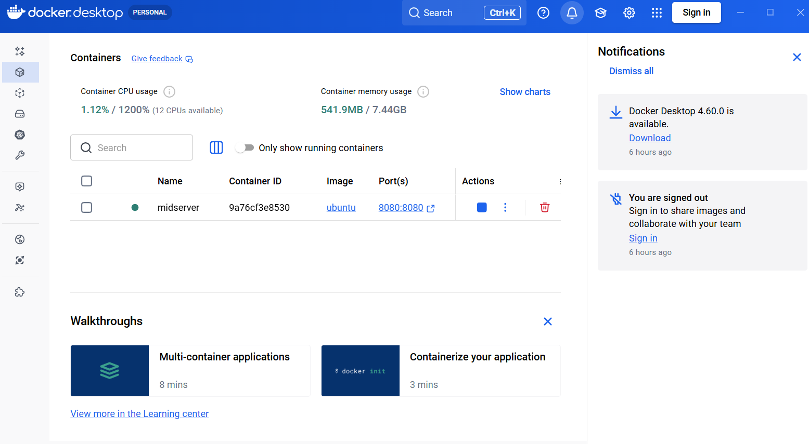
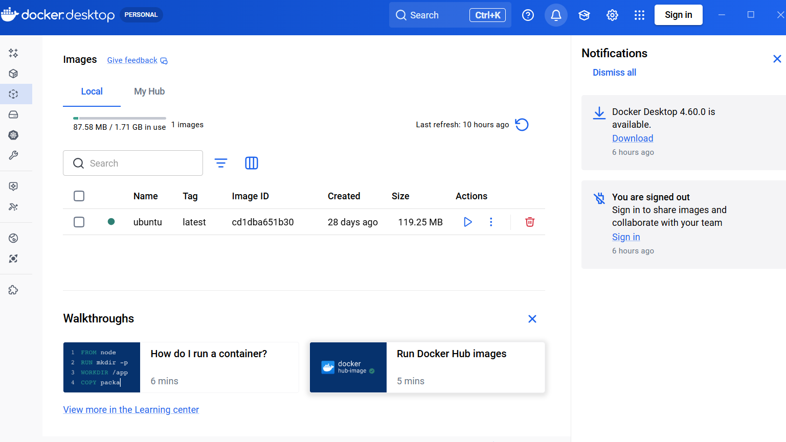

# Simple ServiceNow MID Server using Docker (PDI Testing)

This repository shows how to run a **ServiceNow MID Server locally using Docker**
to test integrations from a **Personal Developer Instance (PDI)**.

This setup is intended for:
- REST integrations
- IntegrationHub testing
- Learning MID Server behavior
- Error handling (MID down, timeout, retry)

---

## Why use Docker for a MID Server?

- No need to install Linux manually
- MID Server survives PC reboots
- Easy to start / stop
- Perfect for ServiceNow PDIs

---

## Prerequisites

- Docker Desktop
- A ServiceNow PDI
- A ServiceNow user with `mid_server` role

---

## What this setup looks like

The MID Server runs inside a Docker container on your local machine
and connects securely to your ServiceNow PDI.




---

## High-level steps

1. Create a MID Server user in ServiceNow
2. Configure MID credentials
3. Run the MID Server container
4. Verify MID status is **Up**
5. Use it in IntegrationHub / REST steps

---

## Starting the MID Server

Once Docker is running:

```bash
docker compose up -d


